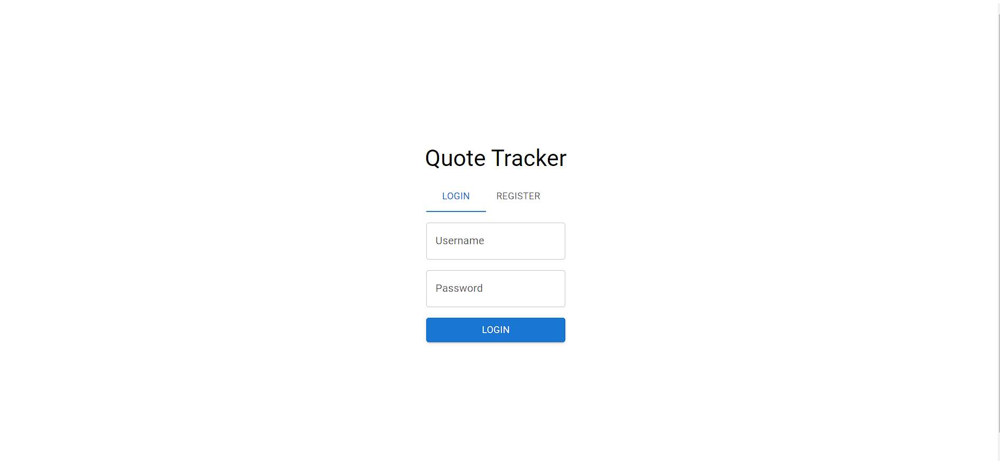
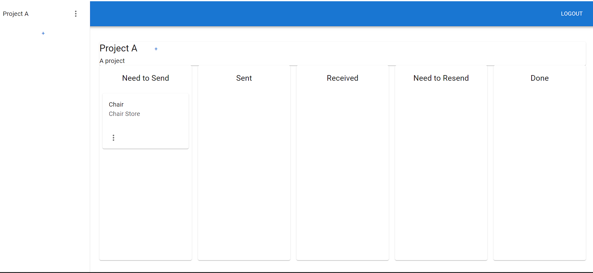

  Quote Request Tracker
   
  <a href="#about"><strong>Explore the screenshots »</strong></a>
   
   
  <a href="https://github.com/gscerveira/QuoteTracker/issues/new?assignees=&labels=bug&template=01_BUG_REPORT.md&title=bug%3A+">Report a Bug</a>
  ·
  <a href="https://github.com/gscerveira/QuoteTracker/issues/new?assignees=&labels=enhancement&template=02_FEATURE_REQUEST.md&title=feat%3A+">Request a Feature</a>
  .
  <a href="https://github.com/gscerveira/QuoteTracker/issues/new?assignees=&labels=question&template=04_SUPPORT_QUESTION.md&title=support%3A+">Ask a Question</a>

 

Table of Contents

- [About](#about)
  - [Built With](#built-with)
- [Usage](#usage)
- [Authors & contributors](#authors--contributors)
- [Security](#security)
- [License](#license)

---

## About

This project aims to provide a simple way to keep track of quote requests for suppliers within whatever project you are working on. The user can create projects and add items to them, each item will belong to a store, and the user can keep track of the quote request status for the items with a simple drag-and-drop functionality. 

The goal is to simplify the management of these requests, allowing the user to see clearly the status of each request, thus avoiding delays and missed steps in the process.

Screenshots

 

> **[?]**
> Please provide your screenshots here.

|                               Login/Register Page                               |                               Dashboard Page                               |
| :-------------------------------------------------------------------: | :--------------------------------------------------------------------: |
|  |  |

### Built With

The **back-end** of this project consists of a REST API, built with the **Django Rest Framework**, it provides three endpoints (projects, stores, and items) for controlling the quote requests' status and three endpoints (login, logout and register) for user authentication, which is handled by Django's session authentication system.

The **front-end** is built with **React.js**, and it consists of two pages, one for login/registration and another with a dashboard for managing the projects and quote requests. The front-end consumes the API through Axios. The UI is built using **MUI** (Material UI) components.

In order to avoid CORS issues, **Nginx** was used to route both the front-end and the back-end through the same domain.

The project is containerized with **Docker**, and the containers are managed with Docker Compose, in order to keep a consistent development environment and to facilitate deployment. For development, there are four containers (front-end, back-end, database, and Nginx), and for production, there are three (front-end, back-end, and Nginx).

The app is hosted on **AWS**, deployed by pulling the Docker images from Docker Hub and running them on an **EC2** instance. The database (PostgreSQL) is hosted on **RDS**.

A simple **Github Actions** workflow is in place, which runs tests (Pytest) on the API's endpoints before merging a pull request to the main branch.

For API Schema generation, **Swagger** is used, with the help of the **DRF-Spectacular** package. The Swagger UI can be accessed [here](http://13.51.20.86:8000/tracker_app/swagger-ui/).

## Usage

To access and use the app, you can visit the [live demo](http://13.51.20.86/).

## Authors & contributors

The original setup of this repository is by [Gabriel Cerveira](https://github.com/gscerveira).

For a full list of all authors and contributors, see [the contributors page](https://github.com/gscerveira/QuoteTracker/contributors).

## Security

Quote Request Tracker follows good practices of security, but 100% security cannot be assured.
Quote Request Tracker is provided **"as is"** without any **warranty**. Use at your own risk.

## License

This project is licensed under the **MIT license**.

See [LICENSE](LICENSE) for more information.

